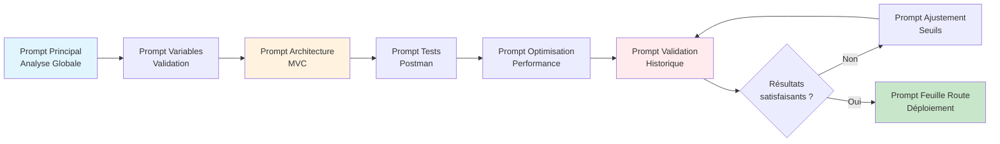

# Prompt d'Analyse Optimisé pour LLM - API Open-Meteo Cyclones

## 🤖 Prompt Principal - Analyse Complète

```
Tu es un expert en météorologie tropicale et en intégration d'APIs. 
Ta mission est d'analyser l'API Open-Meteo pour créer un système de détection 
et suivi des cyclones tropicaux dans l'Océan Indien.

CONTEXTE :
- Zone géographique : Océan Indien (-30° à -5° latitude Sud, 40° à 100° longitude Est)
- Objectif : Détecter les cyclones en temps quasi-réel (mise à jour toutes les 6h)
- Cible : La Réunion, Maurice, Madagascar, Comores
- Contraintes : Solution gratuite, < 10 000 appels/jour

CRITÈRES DE DÉTECTION CYCLONIQUE :
1. Température de surface mer (SST) > 26.5°C
2. Pression atmosphérique < 980 hPa (cyclone) ou < 995 hPa (tempête)
3. Vitesse du vent > 117 km/h (cyclone) ou > 88 km/h (tempête)

ANALYSE DEMANDÉE :
1. Identifier les endpoints disponibles (Weather, Marine, Ensemble)
2. Lister les variables pertinentes pour la détection cyclonique
3. Vérifier la disponibilité des modèles ECMWF (haute résolution)
4. Évaluer la fréquence de mise à jour des données
5. Estimer le nombre d'appels API nécessaires par jour
6. Identifier les limitations techniques (résolution, délai, couverture)
7. Proposer une architecture MVC pour l'intégration
8. Suggérer des stratégies de cache et optimisation

FORMAT DE RÉPONSE :
Structure ta réponse en sections claires avec :
- Titre de section
- Informations factuelles extraites de la documentation
- Exemples d'URL avec paramètres concrets
- Tableaux comparatifs si pertinent
- Avertissements sur les limitations
- Recommandations techniques

SOURCES À CONSULTER :
- Documentation officielle Open-Meteo
- API Weather Forecast : https://open-meteo.com/en/docs
- API Marine Weather : https://open-meteo.com/en/docs/marine-weather-api
- API Ensemble : https://open-meteo.com/en/docs/ensemble-api

LIVRABLES ATTENDUS :
1. Liste des endpoints avec paramètres
2. Tableau des variables cycloniques disponibles
3. Algorithme de détection pseudocode
4. Architecture système MVC
5. Plan de tests Postman
6. Stratégie de gestion d'erreurs
```

---

## 🔍 Prompt Spécifique - Validation Variables

```
Analyse la documentation Open-Meteo et réponds précisément :

QUESTION : Quelles variables météorologiques sont disponibles pour détecter un cyclone tropical ?

CRITÈRES DE VALIDATION :
Pour chaque variable trouvée, fournis :
1. Nom exact du paramètre API (ex: wind_speed_10m)
2. Unité de mesure (ex: km/h, hPa, °C)
3. Endpoint qui la fournit (forecast, marine, ensemble)
4. Résolution spatiale (ex: 9 km, 25 km)
5. Fréquence de mise à jour (ex: 6h, 12h)

VARIABLES CRITIQUES À VÉRIFIER :
- Vitesse du vent (10m, rafales)
- Pression atmosphérique au niveau de la mer
- Température de surface de la mer (SST)
- Hauteur des vagues
- Précipitations
- Direction du vent

FORMAT : Tableau Markdown avec colonnes
| Variable | Paramètre API | Unité | Endpoint | Résolution | Update |

Ne fais PAS d'hypothèses. Si une variable n'est pas documentée, indique "NON DISPONIBLE".
```

---

## 🏗️ Prompt Spécifique - Architecture MVC

```
Conçois une architecture MVC pour un système de suivi cyclonique utilisant l'API Open-Meteo.

CONTRAINTES TECHNIQUES :
- Backend : Python FastAPI ou Node.js Express
- Frontend : React ou Vue.js avec cartes Leaflet/Mapbox
- Base de données : PostgreSQL pour historique
- Cache : Redis avec TTL 6 heures
- Alertes : Email (SMTP) + SMS (Twilio) + Push (Firebase)

COMPOSANTS À DÉFINIR :

**MODÈLE (Model)** :
- Schéma de données pour les prévisions météo
- Schéma pour les cyclones détectés
- Schéma pour les alertes utilisateurs
- Relations entre entités

**VUE (View)** :
- Interface dashboard avec carte interactive
- Liste des cyclones actifs
- Graphiques d'évolution (pression, vent, SST)
- Formulaire de configuration des alertes

**CONTRÔLEUR (Controller)** :
- Endpoint GET /api/cyclones/search (zone géographique)
- Endpoint GET /api/cyclones/:id (détails cyclone)
- Endpoint POST /api/alerts/subscribe (abonnement alertes)
- Service d'intégration Open-Meteo
- Service de détection cyclonique
- Service de notifications

LIVRABLES :
1. Diagramme d'architecture (texte ou Mermaid)
2. Schémas de base de données (SQL)
3. Pseudocode des contrôleurs principaux
4. Algorithme de détection en pseudocode
5. Stratégie de cache et fallback

Sois concret et fournis du code d'exemple si possible.
```

---

## 🧪 Prompt Spécifique - Plan de Tests

```
Crée un plan de tests complet pour valider l'intégration de l'API Open-Meteo.

OBJECTIF : S'assurer que toutes les fonctionnalités critiques fonctionnent correctement.

TESTS À CRÉER :

**1. TESTS DE BASE (Connectivity)**
- Test 1 : Endpoint /v1/forecast accessible (200 OK)
- Test 2 : Paramètres obligatoires latitude/longitude acceptés
- Test 3 : Variables hourly retournent des données

**2. TESTS FONCTIONNELS (Cyclone Detection)**
- Test 4 : Variables cycloniques disponibles (wind, pressure, SST)
- Test 5 : Données cohérentes sur zone Océan Indien
- Test 6 : Algorithme détecte cyclone connu (ex: Cyclone Belal 2024)

**3. TESTS DE PERFORMANCE**
- Test 7 : Temps de réponse < 3 secondes
- Test 8 : Cache fonctionne (pas d'appel API si données < 6h)

**4. TESTS D'ERREUR**
- Test 9 : Gestion 404 si endpoint invalide
- Test 10 : Gestion 429 si rate limit dépassé
- Test 11 : Fallback sur cache si API indisponible

**5. TESTS D'INTÉGRATION**
- Test 12 : Combinaison Weather + Marine APIs
- Test 13 : Notification envoyée si cyclone détecté

POUR CHAQUE TEST, FOURNIS :
- Nom descriptif
- URL complète avec paramètres
- Méthode HTTP
- Assertions de validation (JSON path, status code)
- Code JavaScript Postman pour validation automatique

FORMAT : Collection Postman complète exportable en JSON
```

---

## 📊 Prompt Spécifique - Analyse Comparative

```
Compare les différentes APIs Open-Meteo pour choisir la meilleure solution 
de détection cyclonique.

APIs À COMPARER :
1. Weather Forecast API (api.open-meteo.com/v1/forecast)
2. Marine Weather API (marine.open-meteo.com/v1/marine)
3. ECMWF API (api.open-meteo.com/v1/ecmwf)
4. Ensemble API (ensemble-api.open-meteo.com/v1/ensemble)

CRITÈRES DE COMPARAISON :
| Critère | Weather | Marine | ECMWF | Ensemble |
|---------|---------|--------|-------|----------|
| Résolution spatiale | ? | ? | ? | ? |
| Variables cyclone | ? | ? | ? | ? |
| Fréquence mise à jour | ? | ? | ? | ? |
| Horizon prévision | ? | ? | ? | ? |
| Coût (appels/jour) | ? | ? | ? | ? |
| SST disponible | ? | ? | ? | ? |
| Pression dispo | ? | ? | ? | ? |
| Vent dispo | ? | ? | ? | ? |

ANALYSE :
1. Quelle API est la PLUS ADAPTÉE pour la détection cyclonique ? Justifie.
2. Peut-on COMBINER plusieurs APIs ? Si oui, comment ?
3. Quels sont les COMPROMIS entre précision et coût ?

RECOMMANDATION FINALE :
- API(s) recommandée(s)
- Configuration optimale
- Architecture d'intégration multi-sources si applicable
```

---

## ⚡ Prompt Spécifique - Optimisation Performance

```
Optimise l'utilisation de l'API Open-Meteo pour minimiser les coûts et maximiser 
la réactivité.

CONTRAINTES :
- Limite gratuite : 10 000 appels/jour
- Zone à surveiller : Océan Indien (~2 000 000 km²)
- Mise à jour données : toutes les 6 heures
- Utilisateurs : ~1000 utilisateurs actifs

PROBLÉMATIQUES :
1. Comment couvrir toute la zone sans dépasser la limite ?
2. Quelle stratégie de cache adopter ?
3. Comment gérer les pics de trafic utilisateurs ?
4. Quand rafraîchir les données ?

SOLUTIONS À PROPOSER :

**Stratégie de Grille** :
- Diviser l'Océan Indien en N points de contrôle
- Calculer l'espacement optimal entre points
- Estimer le nombre d'appels nécessaires par cycle

**Stratégie de Cache** :
- TTL (Time To Live) optimal
- Politique d'éviction (LRU, LFU)
- Cache distribué ou local
- Warming du cache

**Stratégie d'Appels** :
- Batch processing vs temps réel
- Priorité géographique (zones à risque)
- Déclenchement conditionnel (si pression < seuil)

CALCULS :
- Nombre de points de grille recommandés
- Fréquence d'appel par point
- Total appels/jour estimé
- Marge de sécurité

PSEUDOCODE de l'algorithme d'optimisation recommandé.
```

---

## 🚨 Prompt Spécifique - Gestion Erreurs

```
Conçois une stratégie robuste de gestion des erreurs et résilience pour 
l'intégration Open-Meteo.

SCÉNARIOS D'ERREUR À GÉRER :

**1. Erreurs API (4xx/5xx)**
- 400 Bad Request : Paramètres invalides
- 404 Not Found : Endpoint inexistant
- 429 Too Many Requests : Rate limit dépassé
- 500 Internal Server Error : Problème côté Open-Meteo
- 503 Service Unavailable : Maintenance

**2. Erreurs Réseau**
- Timeout (> 10 secondes)
- Connection Refused
- DNS Resolution Failed

**3. Erreurs Données**
- JSON malformé
- Valeurs manquantes (null)
- Valeurs aberrantes (vent 999 km/h)

POUR CHAQUE TYPE D'ERREUR, DÉFINIS :

**Détection** :
- Comment identifier l'erreur ?
- Quel code status / exception ?

**Réaction** :
- Retry ? Combien de fois ?
- Backoff exponentiel ? (1s, 2s, 4s, 8s)
- Utiliser cache périmé ?
- Fallback sur API alternative ?

**Logging** :
- Quelles informations logger ?
- Niveau de log (ERROR, WARN, INFO)

**Notification** :
- Alerter l'équipe technique ?
- Informer l'utilisateur ?
- Message à afficher

LIVRABLES :
1. Arbre de décision pour chaque erreur
2. Pseudocode du gestionnaire d'erreurs
3. Table de mapping erreur → action
4. Stratégie de circuit breaker
```

---

## 📈 Prompt Spécifique - Validation Historique

```
Valide l'algorithme de détection cyclonique avec des données historiques réelles.

CYCLONES CONNUS À TESTER :
1. Cyclone Belal (Janvier 2024, La Réunion)
   - Date : 14-16 janvier 2024
   - Position : ~-21°S, 55°E
   - Intensité : Catégorie 2-3

2. Cyclone Batsirai (Février 2022, Madagascar)
   - Date : 3-8 février 2022
   - Position : ~-20°S, 48°E
   - Intensité : Catégorie 4

3. Cyclone Idai (Mars 2019, Mozambique)
   - Date : 4-16 mars 2019
   - Position : ~-19°S, 35°E
   - Intensité : Catégorie 3

MÉTHODOLOGIE :
1. Utiliser l'API Historical Weather de Open-Meteo
2. Requêter les données pour les dates/positions connues
3. Appliquer l'algorithme de détection
4. Comparer avec données officielles RSMC La Réunion

POUR CHAQUE CYCLONE :

**URL Historical API** :
```
https://archive-api.open-meteo.com/v1/archive?
latitude=LATITUDE&
longitude=LONGITUDE&
start_date=DATE_DEBUT&
end_date=DATE_FIN&
hourly=wind_speed_10m,pressure_msl
```

**Validation** :
- Algorithme détecte-t-il le cyclone ? (OUI/NON)
- À quel moment (date/heure) ?
- Classification correcte ? (CYCLONE/TEMPÊTE/DÉPRESSION)
- Faux positifs ?
- Faux négatifs ?

**Métriques** :
- Précision = Vrais Positifs / (Vrais Positifs + Faux Positifs)
- Rappel = Vrais Positifs / (Vrais Positifs + Faux Négatifs)
- F1-Score = 2 × (Précision × Rappel) / (Précision + Rappel)

Fournis les résultats détaillés et ajustements de seuils si nécessaire.
```

---

## 🎯 Prompt Spécifique - Feuille de Route

```
Établis une feuille de route complète pour le projet de suivi cyclonique Open-Meteo.

PHASES DU PROJET :

**PHASE 1 - ANALYSE (Semaine 1-2)**
- [ ] Étudier documentation Open-Meteo
- [ ] Identifier endpoints et variables
- [ ] Créer plan de tests Postman
- [ ] Valider disponibilité données SST, vent, pression
- [ ] Documenter limitations techniques

**PHASE 2 - PROTOTYPE (Semaine 3-4)**
- [ ] Implémenter appel API basique
- [ ] Créer algorithme de détection simple
- [ ] Tester sur zone restreinte (La Réunion)
- [ ] Mettre en place cache Redis
- [ ] Valider avec cyclone historique

**PHASE 3 - MVP (Semaine 5-8)**
- [ ] Architecture MVC complète
- [ ] Backend API REST
- [ ] Frontend dashboard avec carte
- [ ] Base de données PostgreSQL
- [ ] Système d'alertes email
- [ ] Tests unitaires + intégration

**PHASE 4 - PRODUCTION (Semaine 9-12)**
- [ ] Déploiement cloud (AWS/Azure/GCP)
- [ ] Monitoring Prometheus + Grafana
- [ ] CI/CD GitHub Actions
- [ ] Documentation utilisateur
- [ ] Optimisation performance
- [ ] Sécurité (HTTPS, rate limiting)

**PHASE 5 - AMÉLIORATION (Continu)**
- [ ] Machine Learning prédiction trajectoires
- [ ] Intégration sources supplémentaires (satellites)
- [ ] Application mobile iOS/Android
- [ ] API publique pour partenaires
- [ ] Internationalisation (FR/EN)

POUR CHAQUE TÂCHE :
- Durée estimée
- Priorité (P0/P1/P2)
- Dépendances
- Ressources nécessaires
- Critères de validation

RISQUES IDENTIFIÉS :
1. API Open-Meteo indisponible → Mitigation ?
2. Rate limit dépassé → Solution ?
3. Données imprécises → Alternative ?
4. Coûts cloud élevés → Optimisation ?

Fournis un diagramme Gantt ou un tableau chronologique.
```

---

## 💡 Bonnes Pratiques d'Utilisation des Prompts

### ✅ À FAIRE
- **Être spécifique** : Donner contexte géographique, contraintes techniques
- **Fournir exemples** : Inclure URLs, coordonnées, dates réelles
- **Demander format structuré** : Tableaux, listes, JSON
- **Valider sources** : Référencer documentation officielle
- **Itérer** : Commencer large, puis affiner avec prompts spécifiques

### ❌ À ÉVITER
- Prompts vagues : "Explique-moi Open-Meteo"
- Sans contexte : Ne pas mentionner l'objectif cyclones
- Sans contraintes : Oublier limites gratuites (10k/jour)
- Accepter sans vérifier : Toujours croiser avec documentation
- Prompts trop longs : Diviser en sous-prompts spécifiques

---

## 🔄 Workflow Recommandé



**Ordre recommandé** :
1. **Analyse globale** → Vision d'ensemble
2. **Validation variables** → Vérifier disponibilité
3. **Architecture** → Concevoir structure
4. **Tests** → Valider hypothèses
5. **Optimisation** → Améliorer performance
6. **Validation historique** → Prouver efficacité
7. **Feuille de route** → Planifier développement

---

## 📝 Template de Réponse Attendue

```markdown
# Analyse API Open-Meteo - Suivi Cyclonique

## 1. Endpoints Disponibles
[Tableau comparatif]

## 2. Variables Cycloniques
[Tableau avec paramètres, unités, endpoints]

## 3. Limitations Identifiées
[Liste avec impacts]

## 4. Architecture Recommandée
[Diagramme + explications]

## 5. Algorithme de Détection
[Pseudocode ou flowchart]

## 6. Plan d'Action
[Étapes numérotées avec priorités]

## 7. Risques et Mitigations
[Tableau risque → solution]
```

---

## 🚀 Exemples de Prompts en Situation Réelle

### Exemple 1 : Débutant
```
"Je veux créer un système pour détecter les cyclones avec Open-Meteo. 
Par où commencer ? Quelles APIs utiliser ?"
```

### Exemple 2 : Intermédiaire
```
"J'ai besoin de détecter les cyclones tropicaux dans l'Océan Indien avec 
les critères suivants : SST>26.5°C, pression<980hPa, vent>117km/h. 
Quelles variables de l'API Open-Meteo dois-je utiliser ? Fournis les 
paramètres exacts et un exemple d'URL."
```

### Exemple 3 : Avancé
```
"Conçois une architecture microservices scalable pour un système de 
suivi cyclonique temps-réel utilisant Open-Meteo (3 APIs combinées), 
avec cache distribué Redis, queue RabbitMQ pour alertes, et déploiement 
Kubernetes. Inclus stratégie de fallback et circuit breaker. Budget : 
10k appels API/jour."
```

---

**Document créé le 24/11/2025**  
**Pour optimiser l'utilisation des LLMs dans l'analyse de l'API Open-Meteo**
