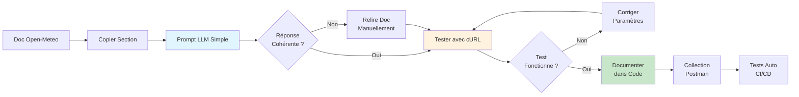

# Prompt Simple d'Analyse Documentation API

## 📝 Prompt à Copier-Coller dans un LLM

```
Analyse uniquement le texte ci-dessous. 
Si une information n'y apparaît pas, réponds "non spécifié". 

Détaille : 
- description du endpoint 
- paramètres 
- structure de réponse 
- erreurs possibles 
- limites

DOC :
[COLLER ICI LA DOCUMENTATION OPEN-METEO]
```

---

## 🎯 Exemple d'Utilisation

### Documentation Source (exemple)

```
The parameter &hourly= accepts the following values. Most weather variables 
are given as an instantaneous value for the indicated hour. Some variables 
like precipitation are calculated from the preceding hour as an average or sum.

pressure_msl : Atmospheric air pressure reduced to mean sea level (msl) or 
pressure at surface. Typically pressure on mean sea level is used in meteorology. 
Surface pressure gets lower with increasing elevation.
```

### Réponse LLM Attendue

**Description du endpoint** :
Non spécifié directement. Le texte mentionne le paramètre `&hourly=` qui accepte plusieurs valeurs, dont `pressure_msl`.

**Paramètres** :
- `pressure_msl` : Pression atmosphérique réduite au niveau moyen de la mer (msl) ou pression en surface
- Format : Valeurs horaires instantanées (sauf variables comme précipitations qui sont moyennes/sommes sur heure précédente)

**Structure de réponse** :
Non spécifié

**Erreurs possibles** :
Non spécifié

**Limites** :
- La pression en surface diminue avec l'augmentation de l'altitude
- Distinction entre valeurs instantanées (la plupart) et valeurs calculées (précipitations)

---

## 📋 Exemples d'Analyse Complètes

### Exemple 1 : Weather Forecast API

**Prompt** :
```
Analyse uniquement le texte ci-dessous. 
Si une information n'y apparaît pas, réponds "non spécifié". 

Détaille : 
- description du endpoint 
- paramètres 
- structure de réponse 
- erreurs possibles 
- limites

DOC :
Weather Forecast API

URL: https://api.open-meteo.com/v1/forecast

The Weather Forecast API provides weather forecasts for any location on earth. 
It uses high-resolution weather models like ECMWF IFS with 9 km resolution.

Required parameters:
- latitude (float): Latitude coordinate (-90 to 90)
- longitude (float): Longitude coordinate (-180 to 180)

Optional parameters:
- hourly (string): Comma-separated list of weather variables
- forecast_days (integer): Number of forecast days (1-16, default 7)
- timezone (string): Timezone identifier (e.g., "Europe/London")

Response format: JSON

Rate limit: 10,000 API calls per day for non-commercial use
```

**Réponse LLM** :

**Description du endpoint** :
- URL : `https://api.open-meteo.com/v1/forecast`
- Fournit des prévisions météorologiques pour n'importe quel lieu sur Terre
- Utilise des modèles météo haute résolution comme ECMWF IFS avec résolution 9 km

**Paramètres** :

*Obligatoires* :
- `latitude` (float) : Coordonnée latitude (-90 à 90)
- `longitude` (float) : Coordonnée longitude (-180 à 180)

*Optionnels* :
- `hourly` (string) : Liste de variables météo séparées par virgules
- `forecast_days` (integer) : Nombre de jours de prévision (1-16, défaut 7)
- `timezone` (string) : Identifiant de fuseau horaire (ex: "Europe/London")

**Structure de réponse** :
Format JSON (détails de structure non spécifiés)

**Erreurs possibles** :
Non spécifié

**Limites** :
- Rate limit : 10 000 appels API par jour pour usage non-commercial
- Forecast days maximum : 16 jours
- Résolution spatiale : 9 km (ECMWF IFS)

---

### Exemple 2 : Marine Weather API

**Prompt** :
```
Analyse uniquement le texte ci-dessous. 
Si une information n'y apparaît pas, réponds "non spécifié". 

Détaille : 
- description du endpoint 
- paramètres 
- structure de réponse 
- erreurs possibles 
- limites

DOC :
Marine Weather API

Base URL: https://marine-api.open-meteo.com/v1/marine

Provides marine weather forecasts including wave height, wave direction, 
wave period and sea surface temperature.

The marine forecast uses the MFWAM wave model with 8 km resolution and the 
ECMWF ocean forecast model for sea surface temperature.

Available variables:
- wave_height: Significant wave height in meters
- wave_direction: Mean wave direction in degrees (0-360°)
- wave_period: Mean wave period in seconds
- sea_surface_temperature: Water temperature at surface in °C

Update frequency: Every 6 hours
Forecast horizon: 7 days

Important: Marine data is only available for ocean and sea areas. 
Land coordinates will return null values.
```

**Réponse LLM** :

**Description du endpoint** :
- URL de base : `https://marine-api.open-meteo.com/v1/marine`
- Fournit des prévisions météo marine incluant hauteur vagues, direction, période et température surface mer
- Utilise le modèle de vagues MFWAM (résolution 8 km) et modèle océanique ECMWF pour SST

**Paramètres** :

*Variables disponibles* :
- `wave_height` : Hauteur significative des vagues en mètres
- `wave_direction` : Direction moyenne des vagues en degrés (0-360°)
- `wave_period` : Période moyenne des vagues en secondes
- `sea_surface_temperature` : Température de l'eau en surface en °C

*Autres paramètres* : Non spécifiés (probablement latitude, longitude similaires à Weather API)

**Structure de réponse** :
Non spécifié (probablement JSON par convention)

**Erreurs possibles** :
- Coordonnées terrestres retourneront valeurs null

**Limites** :
- Fréquence de mise à jour : Toutes les 6 heures
- Horizon de prévision : 7 jours
- Résolution spatiale : 8 km (modèle MFWAM)
- Disponibilité géographique : Uniquement zones océaniques et maritimes (pas de données pour coordonnées terrestres)

---

## 🎓 Guide d'Utilisation du Prompt

### Étape 1 : Trouver la Documentation

Sources officielles Open-Meteo :
- **Weather Forecast** : https://open-meteo.com/en/docs
- **Marine Weather** : https://open-meteo.com/en/docs/marine-weather-api
- **Ensemble API** : https://open-meteo.com/en/docs/ensemble-api
- **Historical Weather** : https://open-meteo.com/en/docs/historical-weather-api

### Étape 2 : Copier Section Pertinente

Sélectionner la section qui vous intéresse :
- Description générale endpoint
- Tableau paramètres
- Exemple de réponse
- Section limitations

**Conseil** : Copier 1-3 paragraphes maximum pour une analyse ciblée.

### Étape 3 : Coller dans le Prompt

```
Analyse uniquement le texte ci-dessous. 
Si une information n'y apparaît pas, réponds "non spécifié". 

Détaille : 
- description du endpoint 
- paramètres 
- structure de réponse 
- erreurs possibles 
- limites

DOC :
[COLLER ICI LE TEXTE COPIÉ]
```

### Étape 4 : Envoyer au LLM

LLMs compatibles :
- ChatGPT (GPT-4, GPT-3.5)
- Claude (Anthropic)
- Gemini (Google)
- Mistral AI
- Llama (local)

### Étape 5 : Valider la Réponse

**Vérifications importantes** :
- ✅ Le LLM dit "non spécifié" pour info absente (pas d'invention)
- ✅ Les paramètres cités existent dans doc source
- ✅ Les valeurs numériques sont exactes
- ✅ Pas d'extrapolation ou supposition

**Si doute** : Retourner à la documentation officielle.

---

## ⚠️ Pièges à Éviter

### ❌ Erreur 1 : Documentation Trop Longue

**Problème** : Copier 10+ pages de documentation
**Conséquence** : LLM se perd, hallucine, ou dépasse limite tokens
**Solution** : Analyser section par section (1-2 paragraphes max)

### ❌ Erreur 2 : Oublier "Non Spécifié"

**Problème** : Ne pas inclure instruction "si absent, dis non spécifié"
**Conséquence** : LLM invente informations manquantes
**Solution** : Toujours garder cette règle dans le prompt

### ❌ Erreur 3 : Confiance Aveugle

**Problème** : Accepter réponse LLM sans vérification
**Conséquence** : Code basé sur paramètres inexistants
**Solution** : Toujours tester avec curl/Postman après

### ❌ Erreur 4 : Mélanger Plusieurs APIs

**Problème** : Coller doc Weather + Marine + Ensemble ensemble
**Conséquence** : Confusion entre endpoints
**Solution** : Une API à la fois

---

## 💡 Variantes du Prompt

### Variante 1 : Focus Cyclones

```
Analyse uniquement le texte ci-dessous pour détecter cyclones tropicaux.
Si une information n'y apparaît pas, réponds "non spécifié". 

Détaille : 
- variables pertinentes pour cyclones (vent, pression, SST)
- unités de mesure
- seuils critiques mentionnés
- résolution spatiale/temporelle
- limitations pour détection cyclonique

DOC :
[DOCUMENTATION]
```

### Variante 2 : Focus Technique

```
Analyse uniquement le texte ci-dessous d'un point de vue développeur.
Si une information n'y apparaît pas, réponds "non spécifié". 

Détaille : 
- méthode HTTP requise
- format requête (query params, body)
- format réponse (JSON, XML, CSV)
- codes status HTTP documentés
- rate limiting et quotas
- authentification requise

DOC :
[DOCUMENTATION]
```

### Variante 3 : Focus Erreurs

```
Analyse uniquement le texte ci-dessous pour identifier gestion erreurs.
Si une information n'y apparaît pas, réponds "non spécifié". 

Détaille : 
- codes d'erreur HTTP mentionnés
- messages d'erreur exemples
- causes d'erreur documentées
- solutions de contournement suggérées
- comportement en cas d'indisponibilité

DOC :
[DOCUMENTATION]
```

---

## 📊 Tableau Comparatif Approches

| Approche | Avantages | Inconvénients | Usage |
|----------|-----------|---------------|-------|
| **Prompt simple** | Rapide, ciblé | Nécessite itérations | Exploration initiale |
| **Lecture manuelle** | 100% précis | Lent, fastidieux | Validation finale |
| **Tests empiriques** | Preuve concrète | Temps setup | Après analyse LLM |
| **Postman collection** | Reproductible | Besoin expertise | Validation continue |

**Workflow recommandé** :
1. Prompt simple LLM → Compréhension rapide
2. Lecture doc ciblée → Validation points clés
3. Tests curl/Postman → Preuve fonctionnement
4. Documentation code → Pour futures maintenances

---

## 🔄 Workflow Complet d'Analyse



---

## ✅ Checklist Analyse API

Avant de considérer une API comme "comprise" :

- [ ] J'ai identifié l'URL base de l'endpoint
- [ ] Je connais TOUS les paramètres obligatoires
- [ ] Je connais les paramètres optionnels utiles
- [ ] J'ai testé UN appel curl qui fonctionne
- [ ] Je connais le format de réponse (JSON/XML/CSV)
- [ ] J'ai identifié les limitations (rate limit, résolution)
- [ ] Je connais les codes erreur possibles
- [ ] J'ai un plan B si API indisponible
- [ ] J'ai documenté pour mon équipe
- [ ] J'ai créé tests automatisés (Postman/pytest)

---

## 📝 Template Résultat d'Analyse

Après utilisation du prompt, documenter ainsi :

```markdown
# Analyse Endpoint : [NOM ENDPOINT]

**Date** : 2025-11-24
**Analysé par** : [Votre nom]
**LLM utilisé** : ChatGPT 4

## URL
`https://api.example.com/v1/endpoint`

## Description
[Résumé fonction endpoint]

## Paramètres

### Obligatoires
| Param | Type | Description | Exemple |
|-------|------|-------------|---------|
| lat | float | Latitude | -21.1 |

### Optionnels
| Param | Type | Défaut | Description |
|-------|------|--------|-------------|
| days | int | 7 | Horizon prévision |

## Réponse Type
```json
{
  "status": "success",
  "data": {...}
}
```

## Erreurs Possibles
- 400 : Paramètres invalides
- 429 : Rate limit dépassé

## Limitations
- Rate limit : 10k/jour
- Résolution : 9 km

## Tests Validés
- [x] cURL basic call
- [x] Postman collection
- [ ] Tests Python automatisés

## Notes
[Observations particulières]
```

---

**Ce prompt simple permet une analyse rapide et fiable de n'importe quelle documentation API ! 🚀**

**Dernière mise à jour** : 24 novembre 2025
