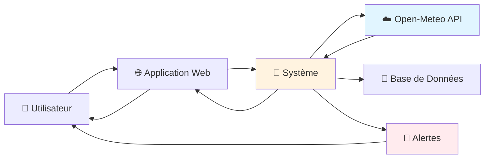
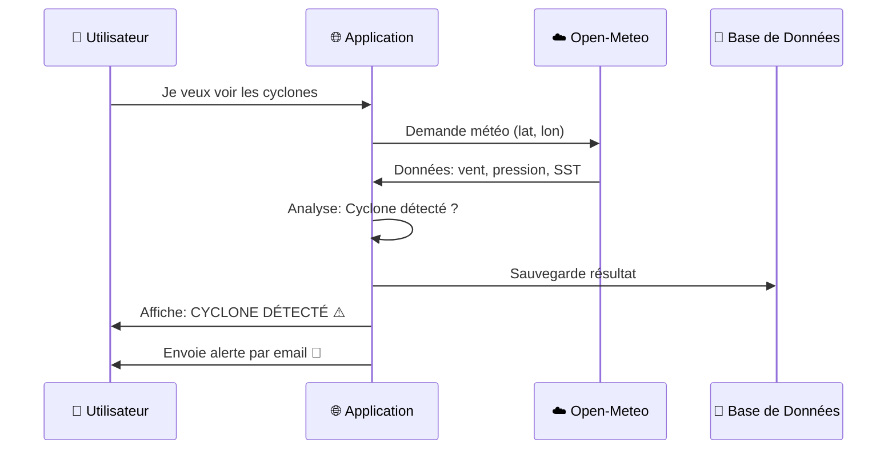
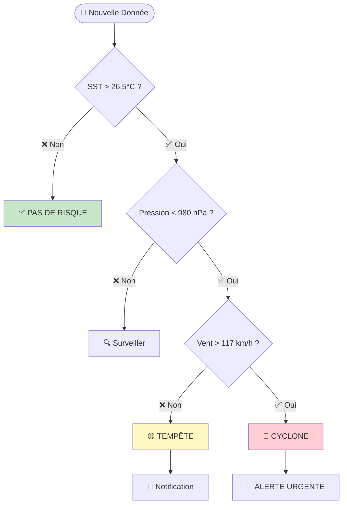
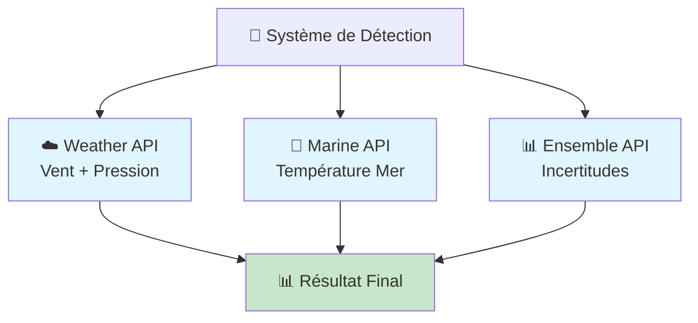
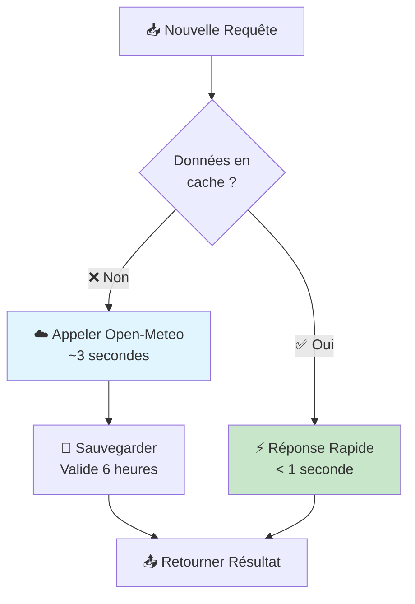
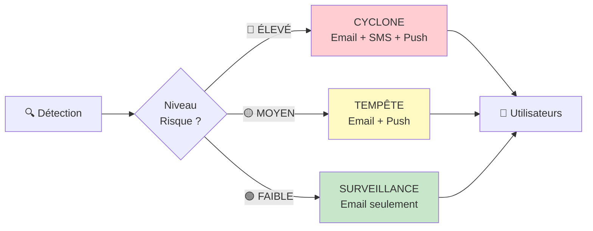
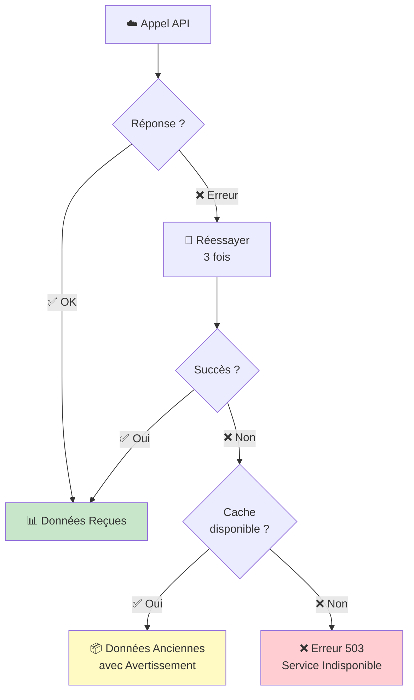
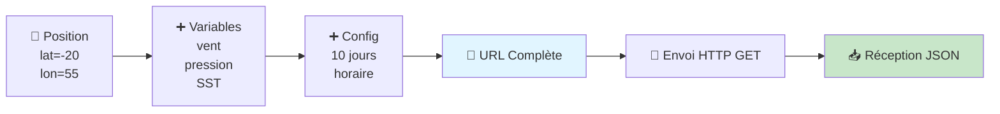
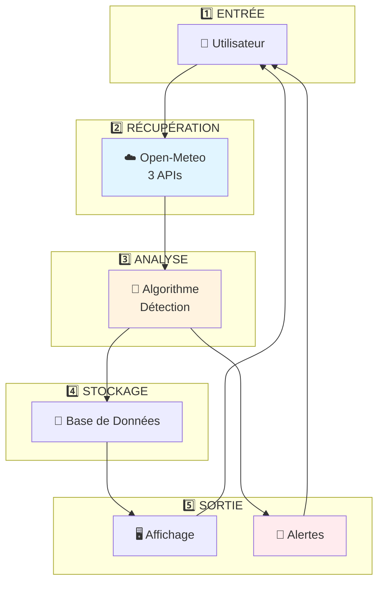
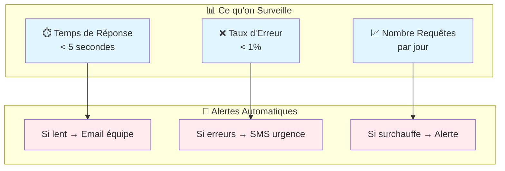

# Schéma de Flux d'Intégration - API Open-Meteo Cyclones

## 🔄 Schémas Simplifiés pour le Suivi Cyclonique

Ce document présente les flux d'intégration de manière simple et claire.

---

## 1. Vue d'Ensemble Simple - Comment ça marche ?

**Explication** : L'utilisateur demande les cyclones → Le système appelle Open-Meteo → Les données sont analysées → Résultats affichés + alertes envoyées si cyclone détecté.

---

## 2. Flux Simple - De la Requête à la Réponse

**Temps total** : ~3 secondes

---

## 3. Détection de Cyclone - Algorithme Simple

**Critères** :
- 🌡️ SST > 26.5°C
- 📉 Pression < 980 hPa  
- 💨 Vent > 117 km/h
= **🔴 CYCLONE**

---

## 4. Les 3 APIs Open-Meteo Utilisées

**3 sources de données** combinées pour détecter les cyclones.

---

## 5. Gestion du Cache - Éviter les Appels Inutiles

**Cache = 6 heures** : Les données météo ne changent que toutes les 6h.

---

## 6. Système d'Alertes - 3 Niveaux

**Plus le risque est élevé, plus on envoie d'alertes.**

---

## 7. Que Faire si Open-Meteo ne Répond Pas ?

**Stratégie** : Retry 3× → Cache ancien → Erreur seulement si tout échoue.

---

## 8. Construction d'une Requête API - Étape par Étape

**Exemple URL** :  
`api.open-meteo.com/v1/forecast?latitude=-20&longitude=55&hourly=wind_speed_10m,pressure_msl`

---

## 9. Workflow Complet - Vue Simplifiée

**5 étapes simples** : Entrée → API → Analyse → Stockage → Sortie

---

## 10. Monitoring Simple - Surveiller le Système

**On surveille** : vitesse, erreurs, charge → alertes automatiques si problème.

---

## 📋 Tableau Récapitulatif Simple

| Élément | Valeur | Explication |
|---------|--------|-------------|
| **Temps de réponse** | 2-4 secondes | Temps pour détecter un cyclone |
| **Cache** | 6 heures | Données valides pendant 6h |
| **Retry** | 3 tentatives | On réessaye 3× si erreur |
| **APIs utilisées** | 3 APIs | Weather + Marine + Ensemble |
| **Niveaux d'alerte** | 3 niveaux | Élevé, Moyen, Faible |

---

## 🎯 Points Clés à Retenir

### ✅ Ce qui est Simple
- **1 requête** → 3 APIs appelées en parallèle
- **Cache intelligent** → Réponse rapide si données récentes
- **3 tentatives** → Le système réessaye si erreur
- **3 niveaux d'alerte** → Plus c'est grave, plus on alerte

### ⚠️ Ce qui est Important
- Les données météo sont **mises à jour toutes les 6 heures**
- Le système **analyse automatiquement** les conditions cycloniques
- Les alertes sont **envoyées automatiquement** si cyclone détecté
- Le **cache permet d'économiser** des appels API

### 🔄 Le Cycle Complet
1. **Utilisateur** demande info cyclone
2. **Système** vérifie le cache
3. Si pas de cache → **Appel Open-Meteo**
4. **Analyse** des données reçues
5. **Détection** cyclone si critères remplis
6. **Sauvegarde** en base de données
7. **Alerte** envoyée si nécessaire
8. **Affichage** résultat à l'utilisateur

---

## 🚀 Comment Utiliser ces Schémas ?

### Pour Comprendre
- **Schéma 1** : Vue générale du système
- **Schéma 2** : Ordre des événements
- **Schéma 3** : Comment on détecte un cyclone
- **Schéma 5** : Comment on accélère avec le cache
- **Schéma 7** : Comment on gère les erreurs

### Pour Développer
- **Schéma 4** : Quelles APIs appeler
- **Schéma 8** : Comment construire une requête
- **Schéma 9** : Les 5 étapes de développement

### Pour Surveiller
- **Schéma 10** : Ce qu'il faut monitorer

---

## 📝 Glossaire Simple

| Terme | Explication Simple |
|-------|-------------------|
| **API** | Interface pour récupérer des données météo |
| **Cache** | Mémoire temporaire pour accélérer |
| **SST** | Température de l'eau de mer |
| **Retry** | Réessayer quand ça échoue |
| **Webhook** | Notification automatique vers autre système |
| **JSON** | Format de données structuré |
| **HTTP GET** | Demander des données à une API |

---

**Document simplifié - Créé le 24/11/2025**  
**Basé sur l'API Open-Meteo pour le suivi cyclonique dans l'Océan Indien**
