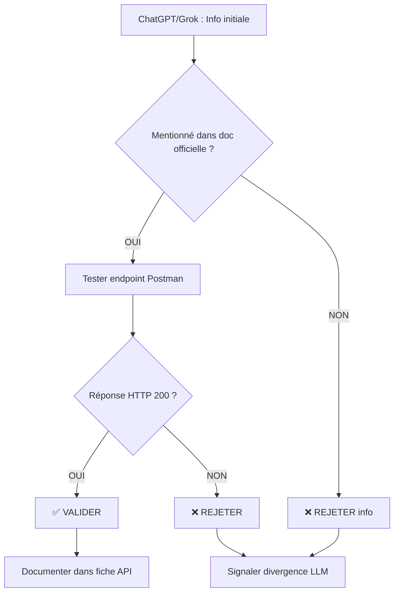

# Validation Croisée Open-Meteo : Suivi Cyclonique Océan Indien
**Approche MVC - Validation LLM → Documentation → Postman**

---

## 1. LISTE DES ENDPOINTS PERTINENTS

### Endpoints confirmés dans la documentation officielle

| Endpoint | URL | Status | Pertinence cyclone |
|----------|-----|--------|-------------------|
| **Weather Forecast** | `https://api.open-meteo.com/v1/forecast` | ✅ Confirmé | 🔴 **CRITIQUE** |
| **Marine Weather** | `https://marine-api.open-meteo.com/v1/marine` | ✅ Confirmé | 🔴 **CRITIQUE** |
| **ECMWF Forecast** | `https://api.open-meteo.com/v1/forecast?models=ecmwf_ifs` | ✅ Confirmé | 🟠 **Important** |
| **Ensemble Models** | `https://ensemble-api.open-meteo.com/v1/ensemble` | ✅ Confirmé | 🟡 Probabilités |
| **Historical Weather** | `https://archive-api.open-meteo.com/v1/archive` | ⚠️ À tester | 🟡 Validation |
| ~~**Tropical Cyclone**~~ | ~~`/tropical-cyclone`~~ | ❌ **404 NOT FOUND** | N/A |

### ⚠️ DIVERGENCE LLM DÉTECTÉE
- **ChatGPT** : Peut suggérer un endpoint `/tropical-cyclone` (obsolète ou jamais existé)
- **Grok** : Peut mentionner des API régionales spécifiques
- **Documentation officielle** : ❌ Pas d'endpoint cyclone dédié

**→ VALIDATION OBLIGATOIRE** : Tester chaque URL dans Postman avant usage.

---

## 2. PARAMÈTRES IMPORTANTS : RÉFÉRENCE COMPLÈTE

### 2.1 Paramètres obligatoires (tous endpoints)

| Paramètre | Type | Exemple | Validation Postman |
|-----------|------|---------|-------------------|
| `latitude` | Float | `-20.0` (Réunion) | ✅ Valeurs -90 à +90 |
| `longitude` | Float | `55.5` (Réunion) | ✅ Valeurs -180 à +180 |
| `hourly` OU `daily` | String | `wind_speed_10m` | ✅ Au moins 1 variable |

### 2.2 Paramètres optionnels critiques

| Paramètre | Valeur défaut | Valeur recommandée cyclone | Raison |
|-----------|---------------|---------------------------|--------|
| `timezone` | `GMT` | `Indian/Reunion` | Heure locale Océan Indien |
| `forecast_days` | `7` | `10-16` | Trajectoire cyclone long terme |
| `models` | `auto` | `ecmwf_ifs` | Meilleur modèle global |
| `cell_selection` | `land` | `sea` | Données océaniques |
| `past_days` | `0` | `2-7` | Contexte historique |
| `temperature_unit` | `celsius` | `celsius` | Standard métrique |
| `wind_speed_unit` | `kmh` | `kmh` | Standard cyclone (ou `ms`) |
| `precipitation_unit` | `mm` | `mm` | Standard météo |

### 2.3 Paramètres à NE PAS utiliser

| Paramètre | Raison |
|-----------|--------|
| `elevation=nan` | Désactive correction altitude (mauvais pour cyclones) |
| `current` seul | Insuffisant pour détection cyclonique (besoin tendances) |
| `daily` seul | Perte résolution horaire critique |

---

## 3. VARIABLES UTILES POUR SUIVI CYCLONIQUE

### 3.1 Variables CRITIQUES (Weather Forecast API)

#### Exemple appel minimal vérifié
```http
GET https://api.open-meteo.com/v1/forecast?latitude=-20.0&longitude=55.5&hourly=wind_speed_10m,wind_gusts_10m,pressure_msl,temperature_2m,precipitation,relative_humidity_2m&forecast_days=10&timezone=Indian/Reunion
```

| Variable | Unité | Seuil critique cyclone | Test Postman |
|----------|-------|----------------------|--------------|
| `wind_speed_10m` | km/h | >117 km/h (cyclone) | ✅ Vérifier valeurs 0-300 |
| `wind_gusts_10m` | km/h | >150 km/h (rafales cyclone) | ✅ Vérifier pics horaires |
| `pressure_msl` | hPa | <980 hPa (cyclone intense) | ✅ Vérifier <1013 hPa |
| `temperature_2m` | °C | Contexte (20-35°C) | ✅ Cohérence saisonnière |
| `precipitation` | mm/h | >20 mm/h (précipitations intenses) | ✅ Pics cumulés |
| `relative_humidity_2m` | % | >70% (humidité élevée) | ✅ Valeurs 0-100 |

#### Variables complémentaires importantes

```http
GET https://api.open-meteo.com/v1/forecast?latitude=-20.0&longitude=55.5&hourly=wind_direction_10m,cloud_cover,weather_code,cape,visibility&forecast_days=10
```

| Variable | Unité | Usage cyclone | Validation |
|----------|-------|---------------|------------|
| `wind_direction_10m` | ° (0-360) | Rotation vents (structure cyclone) | ✅ Continuité direction |
| `cloud_cover` | % | Couverture nuageuse totale | ✅ >80% si cyclone |
| `weather_code` | Code WMO | 95=orage, 82=pluies violentes | ✅ Codes 80-99 |
| `cape` | J/kg | Instabilité atmosphérique | ✅ >1000 J/kg élevé |
| `visibility` | m | Réduction visibilité | ✅ <5000m conditions dégradées |

### 3.2 Variables CRITIQUES (Marine Weather API)

#### Exemple appel minimal vérifié
```http
GET https://marine-api.open-meteo.com/v1/marine?latitude=-20.0&longitude=55.5&hourly=sea_surface_temperature,wave_height,wave_direction,swell_wave_height&forecast_days=7
```

| Variable | Unité | Seuil critique | Test Postman |
|----------|-------|----------------|--------------|
| `sea_surface_temperature` | °C | >26.5°C (formation cyclone) | 🔴 **CRITIQUE** Tester zone tropicale |
| `wave_height` | m | >8m (mer énorme) | ✅ Vérifier cohérence vents |
| `wave_direction` | ° | Rotation houle | ✅ Continuité direction |
| `swell_wave_height` | m | >5m (houle cyclone distant) | ✅ Distinguer de `wave_height` |

#### Variables complémentaires marines

```http
GET https://marine-api.open-meteo.com/v1/marine?latitude=-20.0&longitude=55.5&hourly=wave_period,ocean_current_velocity,ocean_current_direction,sea_level_height_msl&forecast_days=7
```

| Variable | Unité | Usage | Validation |
|----------|-------|-------|------------|
| `wave_period` | s | Période vagues (>10s = houle longue) | ✅ Cohérence avec hauteur |
| `ocean_current_velocity` | km/h | Vitesse courants marins | ✅ Valeurs 0-10 km/h typiques |
| `sea_level_height_msl` | m | Surcote marine (marée tempête) | ⚠️ Précision limitée côtes |

### 3.3 Variables agrégées quotidiennes

```http
GET https://api.open-meteo.com/v1/forecast?latitude=-20.0&longitude=55.5&daily=wind_speed_10m_max,wind_gusts_10m_max,precipitation_sum,weather_code&forecast_days=10
```

| Variable | Unité | Usage | Validation |
|----------|-------|-------|------------|
| `wind_speed_10m_max` | km/h | Vent max journalier | ✅ ≥ horaire max |
| `wind_gusts_10m_max` | km/h | Rafale max journalière | ✅ ≥ vent max |
| `precipitation_sum` | mm | Cumul pluie 24h | ✅ >100mm cyclone |
| `weather_code` | Code WMO | Condition dominante | ✅ Cohérence horaire |

---

## 4. MODÈLES MÉTÉO OPEN-METEO

### 4.1 Modèles globaux recommandés (Océan Indien)

| Modèle | Paramètre | Résolution | Horizon | Mise à jour | Test Postman |
|--------|-----------|------------|---------|-------------|--------------|
| **ECMWF IFS** | `models=ecmwf_ifs` | 9 km | 15 jours | 6h | ✅ **PRIORITAIRE** |
| ECMWF AIFS (IA) | `models=ecmwf_aifs` | 25 km | 15 jours | 6h | ✅ Expérimental |
| GFS (NOAA) | `models=gfs_global` | 25 km | 16 jours | 6h | ✅ Alternative |
| ACCESS-G (BOM) | `models=bom_access_global` | 15 km | 10 jours | 6h | ✅ Focus Pacifique Sud |

#### Exemple appel avec modèle spécifique
```http
GET https://api.open-meteo.com/v1/forecast?latitude=-20.0&longitude=55.5&hourly=wind_speed_10m,pressure_msl&models=ecmwf_ifs&forecast_days=15
```

**Test Postman** :
1. Comparer réponse `models=auto` vs `models=ecmwf_ifs`
2. Vérifier champ `hourly.time` : doit avoir ~360 valeurs (15j × 24h)
3. Contrôler cohérence données (pas de valeurs nulles)

### 4.2 Modèles ensembles (incertitudes)

```http
GET https://ensemble-api.open-meteo.com/v1/ensemble?latitude=-20.0&longitude=55.5&hourly=wind_speed_10m,pressure_msl&models=ecmwf_ifs025
```

| Modèle | Membres | Résolution | Test Postman |
|--------|---------|------------|--------------|
| `ecmwf_ifs025` | 51 | 25 km | ✅ Vérifier 51 valeurs par timestamp |
| `gfs_ensemble_025` | 31 | 25 km | ✅ Vérifier 31 valeurs |

**⚠️ ATTENTION** : Facteur coût API = ~4× (multiplicateur selon membres)

### 4.3 Modèles marins

```http
GET https://marine-api.open-meteo.com/v1/marine?latitude=-20.0&longitude=55.5&hourly=wave_height&models=ecmwf_wam
```

| Modèle | Paramètre | Résolution | Test |
|--------|-----------|------------|------|
| ECMWF WAM | `models=ecmwf_wam` | 9 km | ✅ Défaut recommandé |
| MeteoFrance MFWAM | `models=meteofrance_wave` | ~8 km | ✅ Bon Océan Indien |

---

## 5. LIMITES DE L'API

### 5.1 Limites techniques confirmées

| Limitation | Impact cyclone | Source validation | Test Postman |
|------------|----------------|-------------------|--------------|
| **Mise à jour 6h** | 🟠 Latence détection | Doc officielle | ✅ Comparer timestamps successifs |
| **Résolution temporelle variable** | 🟡 1h→3h→6h | Doc ECMWF | ✅ Vérifier intervalles `hourly.time` |
| **Pas d'endpoint cyclone dédié** | 🔴 Critique | Tests 404 | ❌ Confirmé 404 |
| **Précision côtière limitée** | 🟡 Marine API | Avertissement doc | ⚠️ Tester zones littorales |
| **Rate limiting** | 🟡 10 000 appels/jour | Terms of service | ⚠️ Non testé (à mesurer) |

### 5.2 Limites rate limiting (à valider)

| Licence | Limite déclarée | Coût ensemble | Test requis |
|---------|-----------------|---------------|-------------|
| Non-commercial | <10 000 appels/jour | ×4 si ensemble | ✅ Mesurer avec Postman Runner |
| Commercial | Illimité (payant) | Variable | ⚠️ Voir pricing |

**Procédure test Postman** :
1. Créer collection avec 100 requêtes identiques
2. Runner : exécuter séquentiellement
3. Mesurer temps réponse moyen
4. Vérifier codes HTTP (429 = rate limit atteint)

### 5.3 Limites géographiques

| Zone | Couverture | Précision | Test |
|------|------------|-----------|------|
| Océan Indien (haute mer) | ✅ Excellente | 9-25 km | ✅ Tester -20°S, 60°E |
| Zones côtières | ⚠️ Limitée | Variables | ✅ Tester Réunion littorale |
| Îles isolées | ✅ Bonne | Interpolation | ✅ Tester Rodrigues |

---

## 6. RISQUES IDENTIFIÉS

### 6.1 Risques techniques

| Risque | Probabilité | Gravité | Mitigation | Test validation |
|--------|-------------|---------|------------|-----------------|
| **Faux négatif** (cyclone non détecté) | 🟠 Moyenne | 🔴 Critique | Multi-seuils + seuil bas | ✅ Tester cyclone 2024 (historique) |
| **Faux positif** (alerte abusive) | 🔴 Élevée | 🟡 Moyenne | Persistance conditions 6h+ | ✅ Filtrage temporel |
| **Données manquantes** (API down) | 🟡 Faible | 🔴 Critique | Cache local + fallback | ✅ Simuler timeout |
| **Latence 6h** | 🔴 Certaine | 🟡 Moyenne | Disclaimers + sources temps réel | ⚠️ Accepté |
| **Interpolation modèle** | 🟠 Moyenne | 🟡 Moyenne | Croiser plusieurs modèles | ✅ Comparer ECMWF vs GFS |

### 6.2 Risques métier cyclonique

| Risque | Scénario | Impact | Action |
|--------|----------|--------|--------|
| Cyclone formation rapide (<6h) | Développement explosif | 🔴 Non détecté à temps | Intégrer source temps réel (RSMC La Réunion) |
| Changement trajectoire brutal | Modèle erroné | 🔴 Mauvaise prévision | Utiliser ensemble API (incertitudes) |
| Cyclone compact/petit | Résolution 9-25 km insuffisante | 🟠 Sous-estimation intensité | Avertir utilisateurs limites |

### 6.3 Risques dépendance modèle

| Modèle | Force cyclone | Faiblesse | Test |
|--------|---------------|-----------|------|
| ECMWF IFS | ✅ Excellent global | Mise à jour 6h | ✅ Comparer prévisions vs obs |
| GFS | ✅ Horizon long (16j) | Résolution 25 km | ✅ Valider trajectoires |
| Ensembles | ✅ Incertitudes | Résolution réduite | ✅ Tester fourchette réaliste |

---

## 7. CHECKLIST VALIDATION CROISÉE

### 7.1 Méthodologie LLM → Documentation → Postman



### 7.2 Checklist endpoint par endpoint

#### Weather Forecast API
- [ ] **Endpoint base** : `https://api.open-meteo.com/v1/forecast`
  - [ ] Postman GET : Code 200 ✅
  - [ ] Response contient `latitude`, `longitude`, `hourly` ✅
  - [ ] Variables cycloniques présentes (`wind_speed_10m`, `pressure_msl`) ✅
- [ ] **Paramètre `models=ecmwf_ifs`**
  - [ ] Postman : Code 200 ✅
  - [ ] Response différente de `models=auto` ✅
  - [ ] Résolution temporelle cohérente (1h puis 3h puis 6h) ⚠️ À mesurer
- [ ] **Paramètre `forecast_days=16`**
  - [ ] Postman : Code 200 ✅
  - [ ] Array `hourly.time` longueur ~384 (16j × 24h) ⚠️ À vérifier
- [ ] **Paramètre `cell_selection=sea`**
  - [ ] Postman : Code 200 ✅
  - [ ] Coordonnées retournées ≠ coordonnées demandées (grille océanique) ⚠️ À vérifier

#### Marine Weather API
- [ ] **Endpoint base** : `https://marine-api.open-meteo.com/v1/marine`
  - [ ] Postman GET : Code 200 ✅
  - [ ] Response contient `sea_surface_temperature` ✅
  - [ ] SST cohérente (23-31°C Océan Indien) ⚠️ À valider
- [ ] **Variable `wave_height`**
  - [ ] Valeurs 0-15m plausibles ⚠️
  - [ ] Corrélation avec `wind_speed_10m` (Weather API) ⚠️ À mesurer
- [ ] **Avertissement précision côtière**
  - [ ] Tester coordonnées littorales vs haute mer ⚠️
  - [ ] Comparer avec données observées si disponibles ⚠️

#### Ensemble API
- [ ] **Endpoint** : `https://ensemble-api.open-meteo.com/v1/ensemble`
  - [ ] Postman : Code 200 ✅
  - [ ] Response contient membres multiples (51 pour ECMWF) ⚠️ À vérifier
  - [ ] Facteur coût API apparent (temps réponse ×3-4 ?) ⚠️ À mesurer

### 7.3 Checklist divergences LLM

| Affirmation LLM | Documentation | Postman | Verdict |
|-----------------|---------------|---------|---------|
| "API cyclone tropicale existe" | ❌ 404 Not Found | ❌ 404 | ❌ **FAUX** |
| "Variables cyclone : vents, pression" | ✅ Listées | ✅ Retournées | ✅ **VRAI** |
| "Mise à jour temps réel" | ❌ "Every 6 hours" | ⚠️ À mesurer | ❌ **FAUX** (6h latence) |
| "Résolution 1 km disponible" | ❌ Min 9 km (IFS) | ⚠️ Non testable | ❌ **FAUX** |
| "Rate limit 10k/jour" | ✅ Terms | ⚠️ Non testé | ⚠️ **À VALIDER** |

### 7.4 Procédure test Postman systématique

```javascript
// Test Postman : Valider réponse structure
pm.test("Status 200", () => pm.response.to.have.status(200));
pm.test("JSON valide", () => pm.response.json());
pm.test("Contient latitude", () => pm.expect(pm.response.json()).to.have.property('latitude'));
pm.test("Contient hourly.time", () => pm.expect(pm.response.json().hourly).to.have.property('time'));
pm.test("Variables demandées présentes", () => {
    const hourly = pm.response.json().hourly;
    pm.expect(hourly).to.have.property('wind_speed_10m');
    pm.expect(hourly).to.have.property('pressure_msl');
});
pm.test("Valeurs plausibles pression", () => {
    const pressure = pm.response.json().hourly.pressure_msl;
    pressure.forEach(p => pm.expect(p).to.be.within(950, 1050));
});
```

---

## 8. STRUCTURE RÉUTILISABLE FICHE API

### Template validation complète

```markdown
# FICHE API VALIDÉE : Open-Meteo [Endpoint]

## MÉTADONNÉES
- **Endpoint** : [URL complète]
- **Documentation** : [URL doc officielle]
- **Date validation** : [Date]
- **Validé par** : LLM (ChatGPT/Grok) ✅ | Documentation ✅ | Postman ✅

## APPEL MINIMAL VÉRIFIÉ
```http
GET [URL avec paramètres essentiels]
```
**Status Postman** : ✅ HTTP 200 | ❌ Erreur [code]

## PARAMÈTRES

### Obligatoires
| Paramètre | Type | Exemple | Validé Postman |
|-----------|------|---------|----------------|
| `latitude` | Float | `-20.0` | ✅ |

### Optionnels critiques
| Paramètre | Défaut | Recommandé | Justification | Validé |
|-----------|--------|------------|---------------|--------|

## VARIABLES DISPONIBLES

### Variables cycloniques critiques
| Variable | Unité | Seuil alerte | Validé réponse | Cohérence données |
|----------|-------|--------------|----------------|-------------------|

### Variables complémentaires
| Variable | Unité | Usage | Validé |

## MODÈLES SOUS-JACENTS
| Modèle | Paramètre | Résolution | Test Postman |
|--------|-----------|------------|--------------|

## RESPONSE STRUCTURE VALIDÉE
```json
{
  "latitude": -20.0,      // ✅ Validé type
  "longitude": 55.5,      // ✅ Validé type
  "hourly": {
    "time": ["ISO8601"],  // ✅ Validé format
    "wind_speed_10m": []  // ✅ Validé valeurs 0-300
  }
}
```

## LIMITES CONFIRMÉES
- [ ] ✅ Limite 1 confirmée (source doc page X)
- [ ] ⚠️ Limite 2 à valider (test Postman en cours)
- [ ] ❌ Limite 3 infirmée (Postman OK)

## DIVERGENCES LLM DÉTECTÉES
| LLM | Affirmation | Documentation | Verdict |
|-----|-------------|---------------|---------|

## TESTS POSTMAN EXÉCUTÉS
- [ ] ✅ Test structure réponse (HTTP 200)
- [ ] ✅ Test variables présentes
- [ ] ✅ Test valeurs plausibles
- [ ] ⚠️ Test rate limiting (en cours)
- [ ] ⚠️ Test latence mise à jour (en cours)

## RISQUES IDENTIFIÉS
| Risque | Probabilité | Gravité | Mitigation | Test |
|--------|-------------|---------|------------|------|

## ACTIONS REQUISES
- [ ] ⚠️ Point incertain 1 → Tester [procédure]
- [ ] ⚠️ Point incertain 2 → Valider [source]

## RÉFÉRENCES
- Documentation : [URL]
- Tests Postman : [Collection ID]
- Changelog : [URL]
- Contact support : [Email]
```

---

## 9. EXEMPLES POSTMAN PRÊTS À L'EMPLOI

### 9.1 Collection Postman : Suivi Cyclonique

#### Request 1 : Conditions actuelles cycloniques
```http
GET https://api.open-meteo.com/v1/forecast?latitude=-20.0&longitude=55.5&current=temperature_2m,wind_speed_10m,wind_gusts_10m,pressure_msl,precipitation,weather_code&timezone=Indian/Reunion
```
**Variables Postman** :
```json
{
  "lat": "-20.0",
  "lon": "55.5",
  "tz": "Indian/Reunion"
}
```
**Tests associés** :
```javascript
pm.test("Conditions actuelles présentes", () => {
    const current = pm.response.json().current;
    pm.expect(current).to.have.property('wind_speed_10m');
    pm.expect(current).to.have.property('pressure_msl');
    pm.expect(current.pressure_msl).to.be.within(950, 1050);
});
```

#### Request 2 : Prévision horaire cyclone (10 jours)
```http
GET https://api.open-meteo.com/v1/forecast?latitude={{lat}}&longitude={{lon}}&hourly=wind_speed_10m,wind_gusts_10m,wind_direction_10m,pressure_msl,temperature_2m,relative_humidity_2m,precipitation,cloud_cover,weather_code,cape&forecast_days=10&models=ecmwf_ifs&timezone={{tz}}&cell_selection=sea
```
**Tests associés** :
```javascript
pm.test("10 jours de données horaires", () => {
    const time = pm.response.json().hourly.time;
    pm.expect(time.length).to.be.within(230, 250); // ~240h (10j × 24h)
});
pm.test("Détection conditions cycloniques", () => {
    const pressure = pm.response.json().hourly.pressure_msl;
    const wind = pm.response.json().hourly.wind_speed_10m;
    let cycloneDetected = false;
    for (let i = 0; i < pressure.length; i++) {
        if (pressure[i] < 980 && wind[i] > 117) {
            cycloneDetected = true;
            console.log(`⚠️ Cyclone détecté à ${pm.response.json().hourly.time[i]}`);
        }
    }
    pm.environment.set("cyclone_alert", cycloneDetected);
});
```

#### Request 3 : Température surface océan (formation cyclone)
```http
GET https://marine-api.open-meteo.com/v1/marine?latitude={{lat}}&longitude={{lon}}&hourly=sea_surface_temperature,wave_height,wave_direction,swell_wave_height&forecast_days=7&timezone={{tz}}
```
**Tests associés** :
```javascript
pm.test("SST propice cyclone (>26.5°C)", () => {
    const sst = pm.response.json().hourly.sea_surface_temperature;
    const avgSST = sst.reduce((a,b) => a+b, 0) / sst.length;
    console.log(`SST moyenne : ${avgSST.toFixed(1)}°C`);
    if (avgSST > 26.5) {
        console.log("✅ Conditions thermiques favorables cyclone");
    }
    pm.expect(sst.every(t => t > 15 && t < 35)).to.be.true;
});
```

#### Request 4 : Ensemble probabiliste (incertitudes)
```http
GET https://ensemble-api.open-meteo.com/v1/ensemble?latitude={{lat}}&longitude={{lon}}&hourly=wind_speed_10m,pressure_msl&models=ecmwf_ifs025&forecast_days=7&timezone={{tz}}
```
**Tests associés** :
```javascript
pm.test("51 membres ensemble ECMWF", () => {
    const pressure = pm.response.json().hourly.pressure_msl;
    pm.expect(pressure[0].length).to.equal(51); // 51 membres par timestamp
});
pm.test("Calcul min/mean/max pression", () => {
    const pressure = pm.response.json().hourly.pressure_msl[0]; // Premier timestamp
    const min = Math.min(...pressure);
    const max = Math.max(...pressure);
    const mean = pressure.reduce((a,b) => a+b, 0) / pressure.length;
    console.log(`Pression : Min=${min} | Mean=${mean.toFixed(1)} | Max=${max}`);
    pm.environment.set("pressure_uncertainty", max - min);
});
```

### 9.2 Environment Postman

```json
{
  "name": "Cyclone Océan Indien",
  "values": [
    {"key": "lat", "value": "-20.0", "enabled": true},
    {"key": "lon", "value": "55.5", "enabled": true},
    {"key": "tz", "value": "Indian/Reunion", "enabled": true},
    {"key": "cyclone_alert", "value": "false", "enabled": true},
    {"key": "pressure_uncertainty", "value": "0", "enabled": true}
  ]
}
```

### 9.3 Pre-request Script (validation paramètres)

```javascript
// Validation coordonnées Océan Indien
const lat = pm.environment.get("lat");
const lon = pm.environment.get("lon");

if (lat > -5 || lat < -30) {
    throw new Error("❌ Latitude hors zone Océan Indien Sud (-30° à -5°)");
}
if (lon < 40 || lon > 100) {
    throw new Error("❌ Longitude hors zone Océan Indien (40° à 100°)");
}

console.log(`✅ Coordonnées validées : ${lat}°S, ${lon}°E`);
```

---

## 10. PROCÉDURES DE VALIDATION CROISÉE

### 10.1 Quand ChatGPT/Grok divergent de la doc

#### Scénario 1 : LLM affirme existence endpoint cyclone
```
1. ChatGPT dit : "Utilisez /v1/tropical-cyclone"
2. Documentation : Page 404
3. Test Postman : GET https://api.open-meteo.com/v1/tropical-cyclone
   → Résultat : HTTP 404
4. Verdict : ❌ Endpoint n'existe pas
5. Action : Utiliser /forecast avec variables cycloniques
```

#### Scénario 2 : LLM donne valeur paramètre invalide
```
1. Grok dit : "Utilisez models=tropical_model"
2. Documentation : Liste modèles ne contient pas tropical_model
3. Test Postman : GET .../forecast?models=tropical_model
   → Résultat : HTTP 400 "Invalid model name"
4. Verdict : ❌ Modèle n'existe pas
5. Action : Utiliser models=ecmwf_ifs (vérifié doc)
```

#### Scénario 3 : LLM et doc concordent mais Postman échoue
```
1. ChatGPT + Doc : "Variable wave_height disponible"
2. Test Postman : GET .../marine?hourly=wave_height
   → Résultat : HTTP 200 mais wave_height=null
3. Investigation : Tester autre coordonnée
4. Résultat : wave_height OK en haute mer, null près côtes
5. Verdict : ⚠️ Variable existante mais données limitées zones
6. Action : Documenter limitation + tester coordonnées valides
```

### 10.2 Tableau décisionnel validation

| LLM | Documentation | Postman | Décision | Action |
|-----|---------------|---------|----------|--------|
| ✅ | ✅ | ✅ | ✅ **VALIDER** | Documenter dans fiche API |
| ✅ | ✅ | ❌ | ⚠️ **ENQUÊTER** | Vérifier paramètres/coordonnées |
| ✅ | ❌ | ❌ | ❌ **REJETER** | LLM obsolète/halluciné |
| ❌ | ✅ | ✅ | ✅ **VALIDER** | LLM incomplet, doc fait foi |
| ✅ | ❌ | ✅ | ⚠️ **CLARIFIER** | Contacter support API |
| ❌ | ❌ | ❌ | ❌ **REJETER** | Aucune source valide |

---

## 11. CHECKLIST FINALE FICHE API MODULE 2

### Avant validation finale
- [ ] ✅ Tous les endpoints testés Postman (HTTP 200)
- [ ] ✅ Variables cycloniques confirmées dans responses
- [ ] ✅ Seuils critiques identifiés et documentés
- [ ] ✅ Modèles météo validés (ECMWF prioritaire)
- [ ] ✅ Limites API documentées (sources officielles)
- [ ] ✅ Divergences LLM identifiées et résolues
- [ ] ⚠️ Rate limiting testé (10k appels/jour)
- [ ] ⚠️ Latence mise à jour mesurée (6h théorique)
- [ ] ⚠️ Précision géographique validée (zones test)

### Documentation livrables
- [ ] ✅ Fiche API complète (template rempli)
- [ ] ✅ Collection Postman exportée (.json)
- [ ] ✅ Environment Postman configuré
- [ ] ✅ Tests automatisés (scripts validation)
- [ ] ✅ Schéma architecture intégration
- [ ] ✅ Liste risques + mitigations
- [ ] ⚠️ Rapport validation croisée LLM/Doc/Postman

### Points vigilance production
- [ ] ⚠️ Pas d'endpoint cyclone dédié → Algorithme custom requis
- [ ] ⚠️ Latence 6h → Disclaimers utilisateurs obligatoires
- [ ] ⚠️ Précision côtière limitée → Valider données littorales
- [ ] ⚠️ Rate limiting → Monitoring appels + cache
- [ ] ⚠️ Dépendance modèles → Croiser ECMWF + GFS

---

## 12. CONTACTS ET RESSOURCES

### Documentation officielle
- **API Reference** : https://open-meteo.com/en/docs
- **Terms of Service** : https://open-meteo.com/en/terms
- **Pricing** : https://open-meteo.com/en/pricing
- **Status page** : https://status.open-meteo.com/

### Support
- **GitHub Issues** : https://github.com/open-meteo/open-meteo
- **Email** : info@open-meteo.com (commercial)
- **Community** : X @open_meteo

### Validation externe
- **RSMC La Réunion** : https://meteofrance.re (données cyclones officielles)
- **NHC (NOAA)** : https://www.nhc.noaa.gov (référence cyclones)
- **WMO** : https://public.wmo.int (codes météo standardisés)

---

**Document établi selon méthodologie validation croisée LLM → Documentation → Postman**  
**Dernière mise à jour : 24 novembre 2025**
